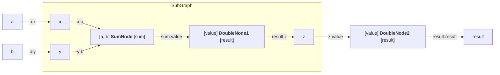

<br />
<div align="center">
  
  <p>
    <strong>
      Powerful node graph pipeline builder library
    </strong>
  </p>
</div>

## Introduction

This project provides builders for creating asynchronously running nodes with any amount of named inputs and outputs of arbitrary type, along with graphs and sub-graphs that dynamically connect and run them. 

`Node` definition:

```Rust
#[async_trait]
pub trait Node: Send + Sync {
    async fn run(
        &self,
        inputs: HashMap<String, Option<Arc<dyn Any + Send + Sync>>>,
    ) -> HashMap<String, Arc<dyn Any + Send + Sync>>;
}
```

`Graph` definition (implements `Node`):

```Rust
pub struct Graph {
    nodes: HashMap<String, Arc<dyn NodeWrapper>>,
    edges: Vec<((String, String), (String, String))>,
    external_inputs: HashMap<String, (String, String)>,
    external_outputs: HashMap<String, (String, String)>,
}
```

Builders:

```Rust
pub struct NodeBuilder<'a>;
pub struct GraphBuilder;
```

## Example

Here is an example straight from the `integration.rs` test:



```Rust
struct SumNode;
#[async_trait]
impl Node for SumNode {
    async fn run(
        &self,
        inputs: HashMap<String, Option<Arc<dyn Any + Send + Sync>>>,
    ) -> HashMap<String, Arc<dyn Any + Send + Sync>> {
        let a = inputs
            .get("a")
            .and_then(|o| o.as_ref())
            .and_then(|v| v.downcast_ref::<i32>())
            .copied()
            .unwrap_or(0);
        let b = inputs
            .get("b")
            .and_then(|o| o.as_ref())
            .and_then(|v| v.downcast_ref::<i32>())
            .copied()
            .unwrap_or(0);
        let mut out = HashMap::new();
        out.insert("sum".to_string(), Arc::new(a + b) as _);
        out
    }
}

struct DoubleNode;
#[async_trait]
impl Node for DoubleNode {
    async fn run(
        &self,
        inputs: HashMap<String, Option<Arc<dyn Any + Send + Sync>>>,
    ) -> HashMap<String, Arc<dyn Any + Send + Sync>> {
        let v = inputs
            .get("value")
            .and_then(|o| o.as_ref())
            .and_then(|v| v.downcast_ref::<i32>())
            .copied()
            .unwrap_or(0);
        let mut out = HashMap::new();
        out.insert("result".to_string(), Arc::new(v * 2) as _);
        out
    }
}

fn subgraph() {
    let mut sub_b = GraphBuilder::new();
    let mut sum_b = sub_b.add_node(SumNode);
    let sx = sum_b.input::<i32>("a");
    let sy = sum_b.input::<i32>("b");
    let ssum = sum_b.output::<i32>("sum");
    let mut dbl_b = sub_b.add_node(DoubleNode);
    let sv = dbl_b.input::<i32>("value");
    let sr = dbl_b.output::<i32>("result");

    sub_b
        .map_input("x", sx)
        .map_input("y", sy)
        .connect(ssum, sv)
        .map_output("z", sr);
    let sub_graph = sub_b.finish();

    let mut parent = GraphBuilder::new();
    let mut sub_node = parent.add_node(sub_graph);
    let px = sub_node.input::<i32>("x");
    let py = sub_node.input::<i32>("y");
    let pz = sub_node.output::<i32>("z");
    let mut dbl2 = parent.add_node(DoubleNode);
    let dv2 = dbl2.input::<i32>("value");
    let dr2 = dbl2.output::<i32>("result");

    parent
        .map_input("a", px)
        .map_input("b", py)
        .connect(pz, dv2)
        .map_output("result", dr2);
    let graph = parent.finish();

    let mut inputs = HashMap::new();
    inputs.insert("a".into(), Arc::new(2i32) as _);
    inputs.insert("b".into(), Arc::new(3i32) as _);

    let out_map = block_on(graph.run(inputs));
    let final_res = out_map["result"].downcast_ref::<i32>().unwrap();

    assert_eq!(*final_res, 20);
}
```

## Plans

Given everything works as expected, the next thing I'll be focusing on is a way to display the graphs without manually having to write a mermaid code block.
